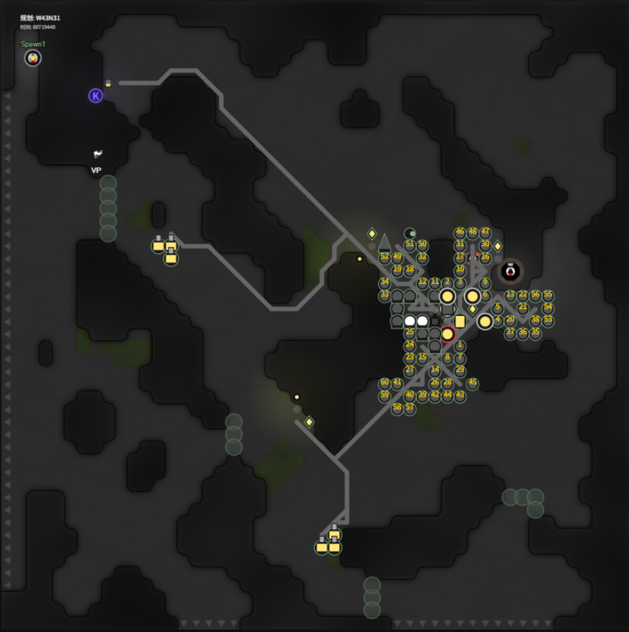
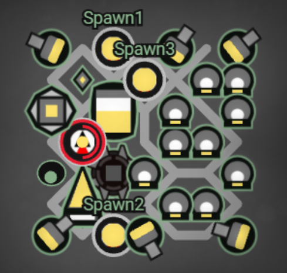
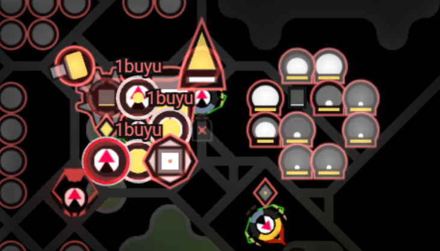
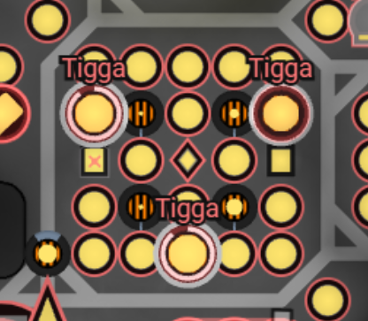
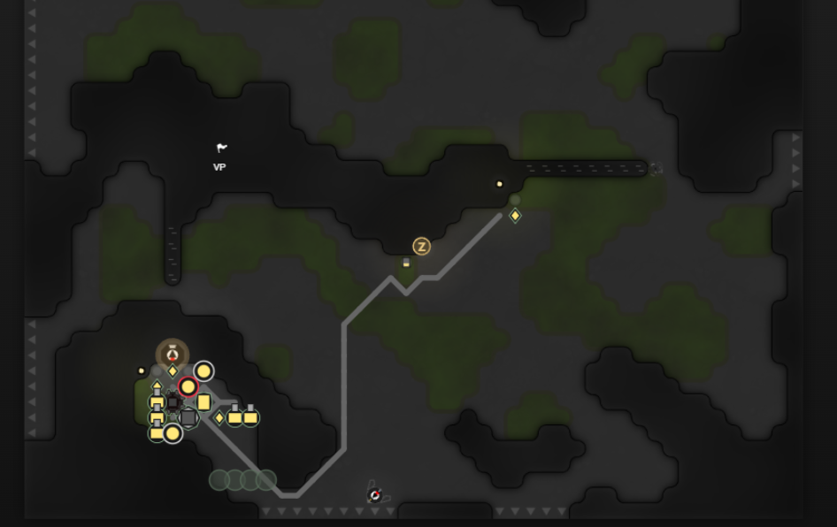
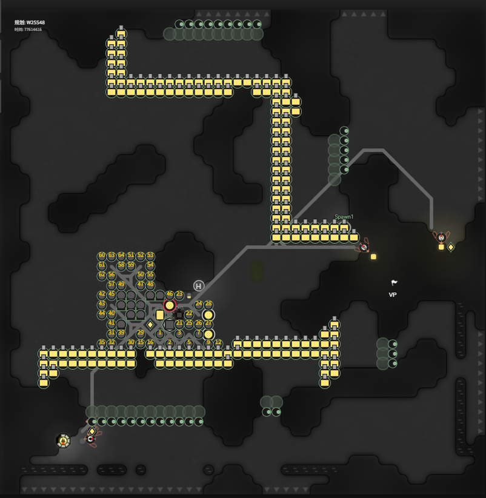
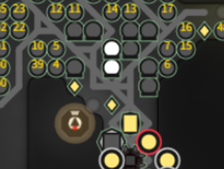
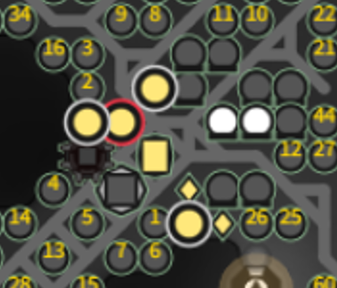
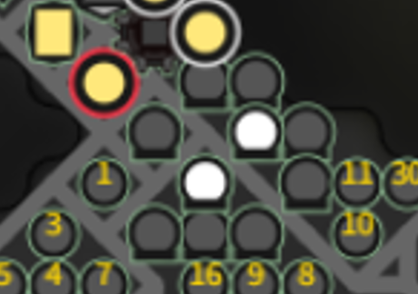

  
QQ群：291065849  
游戏介绍及入手请移步：[hoho大佬简书教程](https://www.jianshu.com/p/5431cb7f42d3)  
[系列目录](https://zhuanlan.zhihu.com/p/104412058)  
Version：1.0   
Author：Scorpior   

# 进阶自动布局


本篇是[**自动布局初级篇**](./自动规划.md)的进阶拓展，建议在了解所有建筑功能及自动布局的基本思路后再阅读。

## 自适应布局

在初级篇中已经提到，如果建筑按一定规则来适应地形，则所需的核心区面积可以大大缩小，在狭窄房间中也能安家。   
一个简单的思路是把除了 extension 以外的建筑都算作中央建筑，只需要一个相对较小的（例如 7×7）正方形就能摆下它们，这样只要房间中最小空地不小于 7×7 就能住下。



### 进阶一步   
为了利用更崎岖的地形，我们可以把上述中央建筑再拆分为不同的小块，例如 storage 区块、spawn 区块、lab 区块等，在相近的范围内为每个小区块找位置。  

    


### 终极形态
如果将所有建筑“一视同仁”，我们就得到了自动布局的终极定义：**找到 N 个空地格子，N 不小于所有建筑总数**。考虑到绝大多数建筑都需要 creep 运输资源才能工作，以及防御入侵的问题，这些空地格子还需满足：
1. 有路可达；
2. 不在 rangedAttack 范围内。

满足上述需要的空地格子可以视为“建筑候选位置”，只需要把所有建筑往格子里摆就能完成布局啦！本文[标题图](#进阶自动布局)中我的布局就是 3x3 核心区摆4个中央建筑后，extension、lab、tower、observer、nuker 都摆在候选位置里。

这里有一个小约束是，只有候选位置足够密集，才适合摆 lab，否则还是需要专门写死个 lab 区块。

### 连通块问题


当核心区足够小时，初级篇中选择空地的方法找核心点时就会遇到上图中的问题，即代价最优的空地可能落在一个过于狭窄的区域，而忽略了房间中真正能摆下所有建筑的空地。  
这个问题的正式描述是，房间内的空地被墙和出口分割成了多个连通块，每个连通块有大有小，我们希望在足够大的连通块中找一个代价最优的空地作为核心点。  
对初级篇中计算空地面积的算法稍作修改，就可以同时统计连通块数量和面积：  
```js
function 找到所有能摆得下建筑的空地(terrain, threshold) {
    let buffer = 边长50的全0二维数组;   // 数组中的数字代表以这个点为右下角的最大空地正方形的边长
    let anchors = [];   // 用于记录所有足够大的正方形的右下角坐标
    let connectedArea = new Map();   // 连通块，key 为每个 pos，value 为 {pos:连通块的根pos, area:连通块的面积}
    
    // 初始化 x=0 和 y=0 两条边
    for (let y = 2; y<48; y++) {    // x = 2
        if (!(terrain[y*50 + 2] & TERRAIN_MASK_WALL)) {     // 如果是空地
            buffer[2][y] = 1;   // 有边长为1的正方形空地
            connectedArea.set([2, y], {pos:[2, y], area:1});   // 初始化连通块为自己
        }
    }
    for (let x = 2; x<48; x++) {    // y = 2
        if (!(terrain[100 + x] & TERRAIN_MASK_WALL)) {     // 如果是空地
            buffer[x][2] = 1;   // 有边长为1的正方形空地
            connectedArea.set([x, 2], {pos:[x, 2], area:1});   // 初始化连通块为自己
        }
    }
    
    // 动态规划遍历所有点
    for (let x = 3; x<48; x++) {
        for (let y = 3; y<48; y++) {
            if (!(terrain[y*50 + x] & TERRAIN_MASK_WALL)) {     // 如果是空地
                buffer[x][y] = 1 + min(buffer[x-1][y-1], buffer[x-1][y], buffer[x][y-1]);   // 递推公式
                if (buffer[x][y] > threshold) {     // 大于阈值
                    anchors.push([x, y]);   // 记录坐标
                }
                // 连通块统计
                let lastRoot = null;
                for (let pos of [[x-1, y-1], [x-1, y], [x, y-1]]) {
                    let root = connectedArea.get(pos); 
                    if (root == null) continue;     // 没有根的点是 wall，不用考虑
                    let key = pos;
                    while (key != root.pos) {   // 只有 key == root.pos 时是真正的根
                        key = root.pos;
                        root = connectedArea.get(key);
                    }
                    if (lastRoot == null) {
                        lastRoot = root;
                    } else if (lastRoot != root) {
                        // 往大的合并
                        if (root.area > lastRoot.area) {
                            root.area += lastRoot.area;
                            lastRoot.pos = root.pos;
                            lastRoot = root;
                        } else {
                            lastRoot.area += root.area;
                            root.pos = lastRoot.pos;
                        }
                        // 合并后更新当前 pos 的根
                        connectedArea.set(pos, lastRoot);
                    }
                }
                // 如果相邻的3个格子不全为墙，则将当前点加入连通块
                if (lastRoot != null) {
                    lastRoot.area++;
                    connectedArea.set([x, y], lastRoot);
                }
                // 否则，当前点自成一个连通块
                else {
                    connectedArea.set([x, y], {pos:[x, y], area:1});
                }
            } // else buffer[x][y] = 0 即初始值
        }
    }
    
    return anchors, connectedArea; // 返回所有足够大的正方形右下角坐标，以及连通块信息
}
```


## 最小割修墙

最小割的目的是只造最少的墙（后续统一称作 rampart），节约能量并减少被入侵时需要防守的阵线长度。[OverMind 仓库](https://github.com/bencbartlett/Overmind/blob/master/src/algorithms/minCut.ts) 和 [Harabi 仓库](https://github.com/sy-harabi/screeps-utils/blob/33a0a406d86ed0a916d540340b3d07e3f5992065/utils.js#L204) 都有代码，本文就不解释了。   
需要考虑的是，墙离自己建筑的最小距离需要满足敌人 rangedAttack 无法攻击到建筑，简单来说就是将建筑作为源点 bfs，距离不超过4的点也都加入作为源点。   
得到 rampart 位置后，一个新的问题是需要重新考虑哪些区域可能被敌方攻击到，以便对暴露在 rampart 之外的 controller 相邻点、能被隔墙 rangedAttack 到的建筑等加 rampart。要实现这个统计，可以利用两遍 BFS 实现：
1. 先从 rampart 保护区域内任意点开始 BFS，将自然墙和 rampart 都视为不可连通，记录所有访问到的平原或沼泽格子（无论其上是否有建筑物），称为**内部空地**，对应的未被访问到的空地称为**外部空地**。
2. 从 exit 开始 BFS，记录每个格子的 dist：
```js
function 计算RangedAttack范围(内部空地, exits) {
    for (let 格子 of exits) {
        BFS队列.push(格子);
        格子.dist = 0;
    }
    for (let 格子 of BFS队列) {
        dist = 格子.dist;
        if (dist > rangedAttack 最远距离) continue;
        for (let 邻居 of 格子的邻居) {
            if (邻居是墙或 rampart || 邻居 in 内部空地) {
                if (邻居.dist > dist + 1 || 邻居.dist 未被设置过) {
                    邻居.dist = dist + 1;
                    BFS队列.push(邻居);
                } 
            } else {
                // 邻居是外部空地
                if (邻居.dist 未被设置过) {
                    邻居.dist = 0;
                    BFS队列.push(邻居);
                } 
            }
        }
    }
}
```
经过如上算法，内部空地中 `dist > 0` 的点，就是敌人 rangedAttack 可以攻击到的点。


## Tower 伤害最大化
从固定布局进阶到自适应布局后，tower 位置就需要计算了，总体目标肯定是在满足玩家自己偏好的情况下让 tower 伤害最大化。本文提供参考步骤如下：
1. 先确定一批用于 tower 的候选空地，可以是核心建筑附近的空地，也可以是靠近 rampart 且不会被攻击到的空地，例如下图中用 tower 表示的位置；
2. 确定敌人可能抵达的最近位置，一般是要防止敌人拆墙，所以我们可以只考虑 rampart 相邻的外围格子，例如下图中用 observer 表示的位置：


3. 对于每个候选空地，按游戏内 tower 伤害衰减规则计算其对所有敌人位置的伤害，加起来得到这个空地造 tower 的总伤害，然后选取总伤害最大的6个空地造 tower。

按照以上步骤，大多数情况下将得到 6 个挨在一起的 tower，对于从房间另一端过来的敌人就没什么威胁了。如何兼顾“伤害最大化”和“不要出现薄弱点“两个需求呢？这就留给读者自己思考咯（手动狗头）。


## Lab 的 Free-Style
在自适应布局且“建筑候选位置”足够密集情况下，就可以避免使用固定形状的 lab 而是自由选取 lab 位置了。简单来说就是遍历候选位置，选择 `range <= 2` 范围内候选位置不少于10个的点进一步判断是否有两个中央 lab（原料 lab）可以满足所有其他 lab `range <= 2`。

```js
function placeLab(候选位置) {
    let found = false;
    for (let 格子A of 候选位置) {
        let 格子A的邻居 = [];
        for (let x of [格子A.x-2, ..., 格子A.x+2]) {
            for (let y of [格子A.y-2, ..., 格子A.y+2]) {
                if (x == 格子A.x && y == 格子A.y) continue;
                if (候选位置.has([x, y])) {
                    格子A的邻居.push([x, y]);
                }
            }
        }
        // 算上格子A本身一共不少于10个
        if (格子A的邻居.length >= 9) {
            let 同时被A和B覆盖的格子, 格子B;
            for (格子B of 格子A的邻居) {
                同时被A和B覆盖的格子 = [];
                for (let x of [格子B.x-2, ..., 格子B.x+2]) {
                    for (let y of [格子B.y-2, ..., 格子B.y+2]) {
                        if (x == 格子B.x && y == 格子B.y) continue;
                        if (候选位置.has([x, y])) {
                            同时被A和B覆盖的格子.push([x, y]);
                        }
                    }
                }
                if (同时被A和B覆盖的格子.length >= 8) {
                    found = true;
                    break;
                }
            }
            if (found) {
                return [格子A, 格子B, ...同时被A和B覆盖的格子.slice(0, 8)];
            }
        }
    }
}
```

展示一些我算法得到的 lab 布局（白色为原料 lab）：  

     
     
     
  

## Link 效能最大化

绝大多数玩家都将 link 用于房间内两个 source、controller 以及 storage 附近，这些位置一共只需要4个 link，而8级房一共有6个 link。剩余的两个 link 如果能利用起来，可以进一步减少我们运维的成本。   
为了最大化 link 效能，我们需要将 link 建在能量吞吐量最大的位置，考虑以下几个问题：
* Q：还有哪些位置需要能量传输？
    * A：外矿，填tower，修建建筑，填 extension。
* Q：如何评估各处能量吞吐量？
    * 外矿：从 storage 出发 BFS，计算 `每个roadPos的吞吐量 = 该road通往的外矿总数 * 每个外矿每tick产量 * 该roadPos到storage的路程`
    * 填 tower：`每个roadPos的吞吐量 = 该road通往的tower总数 * 1000 * 该roadPos到storage的路程`
    * 修建建筑：`每个roadPos的吞吐量 = sum(该road通往的constructionSite的能量需求) * 该roadPos到storage的路程`
    * 填 extension：从 storage 出发 BFS，计算 `每个roadPos的吞吐量 = sum(该road通往的extension容量) * 该roadPos到storage的路程`

如上经过 BFS 我们能得到每个 roadPos 的吞吐量，然后取最大值所在的位置几个位置建 link 即可。